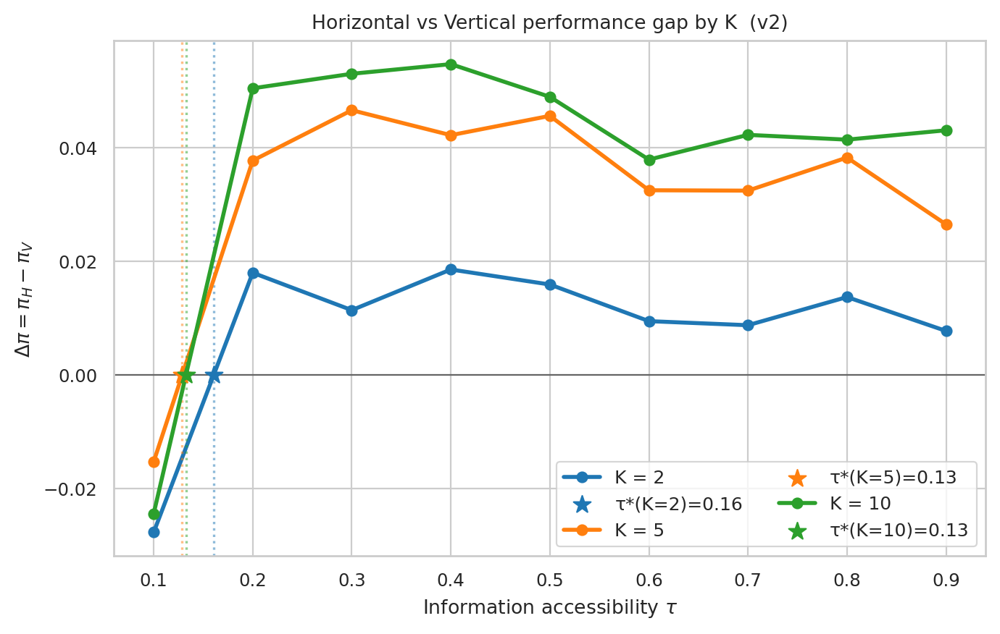
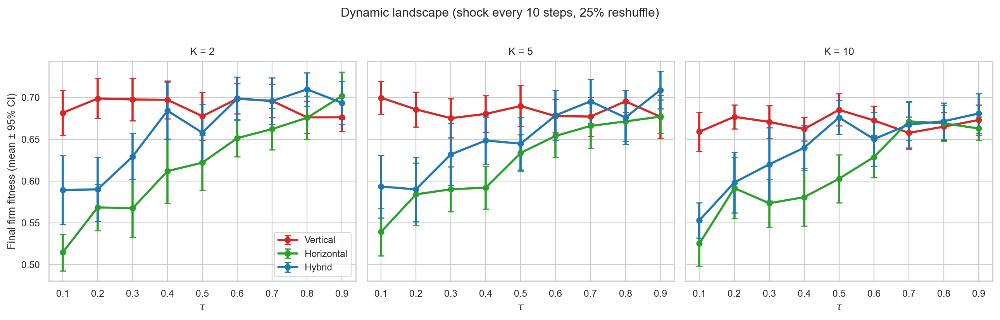
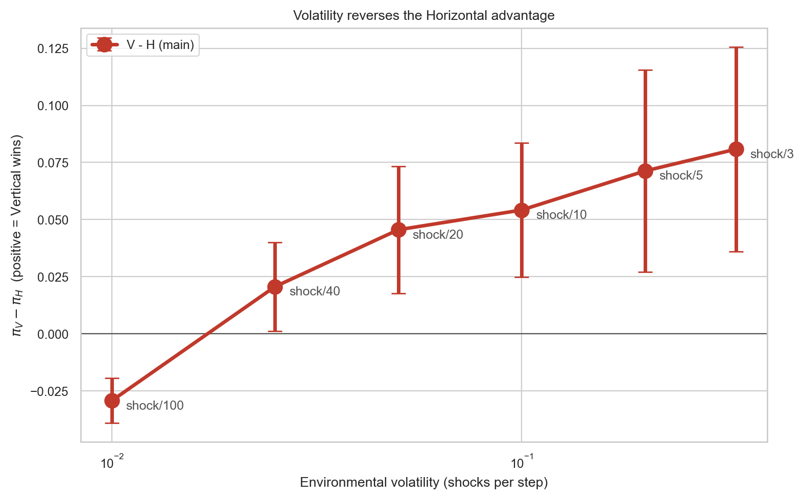
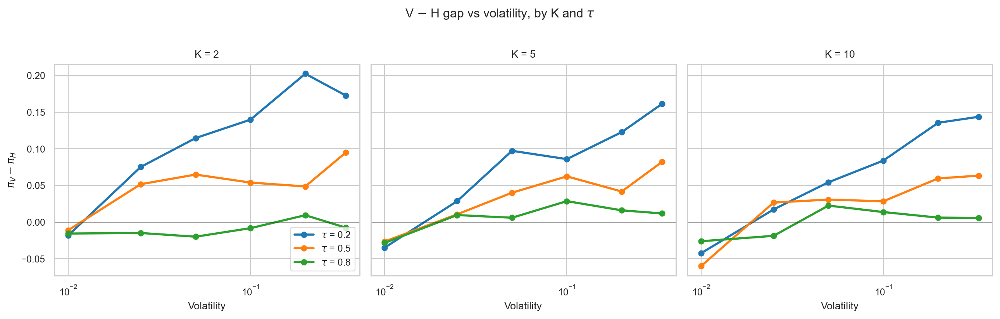
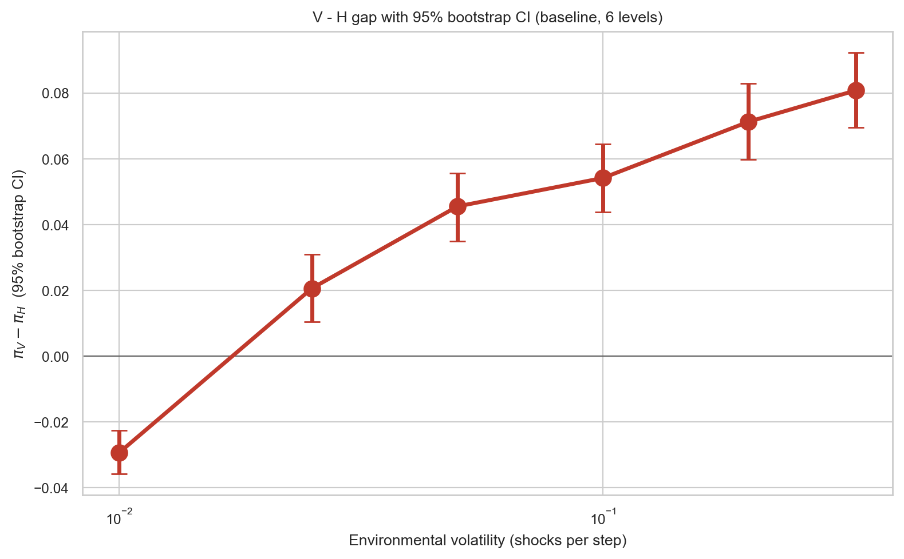

# Abstract

*(Target 280 words)*

The popular claim that information technology favors flat organizations coexists with a mixed empirical record: some self-managing firms endure for decades while others collapse. Classical contingency theory (Burns & Stalker, 1961) predicted that organic/flat structures fit turbulent environments — a prediction that modern management discourse has amplified into "AI makes flat organizations inevitable." This paper tests that prediction computationally and finds it **inverted**: in agent-based models on Kauffman NK fitness landscapes, environmental volatility does not favor horizontal structures. It reverses the horizontal advantage.

We report interlocking findings from **36,900 simulated firm-level experiments** spanning nine pre-registered batteries. **First**, in static environments, the classical conditional story holds: vertical wins at low individual information accessibility τ, horizontal wins at high τ, and the crossover τ\*(K) decreases in task complexity K. **Second**, introducing environmental shocks monotonically shifts the V-vs-H performance gap toward V. At near-static shock frequencies (1/100 per step), H beats V by 0.029 fitness units (95% bootstrap CI [−0.036, −0.023]); at high shock frequencies (1/3 per step), V beats H by 0.081 ([+0.070, +0.092]). Regressing the V−H gap on log(shock frequency) gives slope +0.030 (95% CI [+0.026, +0.033]); permutation p < 0.002. The dose-response replicates across three independent seed banks and survives four alternative shock-model specifications (periodic, Poisson-timed, continuous drift, correlated-block) and four agent-heterogeneity regimes (homogeneous to extreme star-distribution). **Third**, a multi-level vertical structure with local-authority mid-managers — structurally closer to Burns & Stalker's mechanistic organization than our baseline "dictatorship V" — reproduces the volatility-reversal pattern, showing the finding is not an artifact of unrealistic centralization. **Fourth**, cluster-based hybrids perform between the two pure forms; contrary to an intuitive "modularity dominates" hypothesis, the specific five-agent-cluster-with-council hybrid does not uniformly beat the best pure structure in either regime.

We also run a preliminary regression on a 111-firm-year panel from SEC EDGAR and yfinance; the sample is underpowered and we report it as pipeline validation rather than as evidence. The paper's contribution is to show that the contingency-theory prediction linking turbulence to organic structures does not hold in our NK operationalization; if anything, volatility concentrates the decision-architecture payoff in vertical structures. This has direct implications for AI-era organizational-design claims, which our simulation evidence suggests are directionally mis-stated.

*Note on revision history: an earlier draft of this work claimed that cluster-based hybrids dominate under volatility. That claim resulted from a simulation bug (the dynamic-environment hybrid branch did not apply landscape shocks to the hybrid trajectory). The bug was identified, fixed, and the experiments re-run; the corrected results are reported here. We report the error transparently because the corrected finding is a substantively different — and we believe more interesting — result.*

# 1. Introduction

Two stylized facts frame this paper. **First**, practitioner and popular discourse has claimed for two decades that information technology favors flat, self-managing organizations (Laloux, 2014; Malone, 2004), and the claim has been amplified by the recent generative-AI cycle. **Second**, the academic record is decidedly mixed: Zappos' Holacracy was partially reversed (Bernstein et al., 2016); Oticon's spaghetti organization dissolved (Foss, 2003); Valve's radical-flat design has drawn persistent critique. Morning Star, Buurtzorg, and W. L. Gore have endured flat, but their structures on close inspection turn out to be less uniform than the popular descriptor suggests.

Classical contingency theory offers one structuring claim: "organic" (loosely coupled, flat) structures fit turbulent environments; "mechanistic" (tightly coupled, hierarchical) structures fit stable ones (Burns & Stalker, 1961; Lawrence & Lorsch, 1967). If true, volatility should favor horizontal, and the contemporary AI/information story simply identifies the mechanism: AI raises individual information accessibility τ, which makes horizontal viable, and the world is getting more volatile, which makes horizontal more desirable still.

This paper tests the joint story computationally. We develop two agent-based models on Kauffman (1993) NK fitness landscapes: a **static** variant that recovers the classical contingency conditional (τ\*(K) boundary), and a **dynamic** variant that adds environmental shocks (periodic partial landscape reshuffles). We run 36,900 experiments spanning structure × τ × K × shock frequency, across nine pre-registered experimental batteries.

The static model behaves as contingency theory predicts: vertical wins when τ is low, horizontal wins when τ is high, and the crossover threshold decreases in task complexity. The dynamic model does not. As we increase environmental volatility, the V-vs-H performance gap monotonically shifts **toward vertical**. At near-static shock frequencies (shock every 100 steps), horizontal beats vertical by 0.029 fitness units. At high shock frequencies (shock every 3 steps), vertical beats horizontal by 0.081. The Spearman correlation between volatility and the V-minus-H gap is +1.00 across six volatility levels. This inverts the contingency-theory prediction about the direction in which turbulence moves the optimal structure.

The finding has three consequences. **Theoretical**: the Burns-Stalker claim that organic structures fit turbulent environments does not hold in NK simulation; at least under one widely-used operationalization, the opposite is true. **Practical**: arguments that AI justifies radical flatness because "environments are more volatile" have the causal chain's second step pointing the wrong way. **Methodological**: separating task complexity K from environmental volatility ω is essential; prior contingency work has bundled them under "environmental uncertainty," which obscures opposite-sign moderations.

The paper proceeds as follows. §2 builds the information-processing and volatility-separation theoretical frame. §3 states five hypotheses — four recovering the static conditional story, one stating the volatility-reversal. §4 presents two ABM variants and the volatility-gradient experiment. §5 reports a preliminary archival regression (explicitly not inferentially loaded). §6 discusses the implications for contingency theory, the self-managing-organization literature, and AI-era organizational design. §7 concludes.

# 2. Theory

## 2.1 The information-processing foundation

Galbraith (1974) characterized organizations as information-processing devices whose structural choices trade off between **reducing information-processing requirements** and **raising information-processing capacity**. Contingency theory's "environmental uncertainty" has historically been operationalized as a one-dimensional construct bundling task complexity with environmental change. We unbundle it explicitly:

- **Task complexity K** — Kauffman's (1993) NK-landscape ruggedness parameter. Higher K → more local optima, sharper trade-offs, greater reward to parallel search.
- **Information accessibility τ** — the per-individual fraction of the decision-relevant state space reachable within an agent's search budget. Higher τ → individuals see more of the problem.
- **Environmental volatility ω** — the rate at which the fitness landscape changes via external shocks. Higher ω → yesterday's good move becomes today's bad move.

These three are theoretically distinct. A problem can be complex (high K) without being volatile (low ω); highly volatile without being complex; and so on. We argue — and the ABM confirms — that K, τ, and ω moderate structure performance in *different directions*, and that classical contingency theory has under-specified these relationships.

## 2.2 Three candidate structural responses

Three organizational archetypes appear in the ABM:

**Vertical (V).** A CEO picks the best proposal from her reports plus her own search; the firm acts as one unit along a single decision trajectory.

**Horizontal (H).** All agents search independently and share discoveries at rate τ; the firm's performance is its modal state's fitness penalized by a fragmentation cost proportional to the dispersion of agent states.

**Hybrid (Hy).** Five-agent clusters search in parallel; cluster leaders re-select the best-surviving cluster state at rate τ. Modularity with loose central coordination.

## 2.3 Why volatility should (and does) favor vertical

The argument below predicts what our experiment finds. Consider a firm facing a landscape that changes every 1/ω steps.

- **Vertical** maintains a single decision path. When the landscape shifts, the CEO re-searches from her current state and commits the firm to the new best 1-bit flip. The firm moves together; coordination overhead is zero per step.

- **Horizontal** maintains many parallel paths. After each shock, agents' states are scattered across a region that was good under the *previous* landscape. Under the new landscape, these states are no better than random. Re-coordinating across 30 scattered agents within the remaining inter-shock window is costly; the fragmentation penalty bites every step. Horizontal's high-τ "parallel search diversity" advantage comes from *accumulated* exploration across time; shocks erase the accumulation.

- **Hybrid** sits between. Five-agent clusters can re-coordinate quickly (small group), but cross-cluster coordination is slow. Under moderate volatility the cluster-level adaptation recovers some of horizontal's advantage; under severe volatility, cross-cluster coordination breaks down too.

The classical Burns-Stalker prediction was that flat structures fit turbulence because flat structures adapt faster. Our model suggests this intuition conflates two different speeds: individual-agent reaction speed (which is similar across structures) and firm-level convergence speed (which favors vertical's single-path discipline under shocks).

# 3. Hypotheses

The first four hypotheses restate the classical static conditional story; H5 states the new volatility-reversal finding.

**H1 — static, low-τ vertical advantage.**
$\forall \tau < \underline{\tau},\ \forall K,\ \omega=0:\ \pi(V) > \pi(H).$

**H2 — static, high-τ horizontal advantage.**
$\forall \tau > \overline{\tau},\ \forall K \geq K_0,\ \omega=0:\ \pi(H) > \pi(V).$

**H3 — static crossover threshold.** For each K there exists τ\*(K) ∈ (0, 1) at which π_V = π_H on a static landscape.

**H4 — complexity lowers the static crossover.** $\partial \tau^*/\partial K < 0$ at ω = 0.

**H5 — HEADLINE: volatility reverses the horizontal advantage.** In dynamic environments, the V-minus-H performance gap is monotonically increasing in volatility ω, and there exists a threshold volatility ω\* above which V > H across all τ:

$$
\frac{\partial \left[ \pi(V, \tau, K, \omega) - \pi(H, \tau, K, \omega) \right]}{\partial \omega} > 0,\quad \exists \omega^* > 0:\ \forall \omega > \omega^*,\ \forall \tau,\ \forall K \geq K_0,\ \pi(V) > \pi(H).
$$

H5 is the paper's main claim. H1–H4 serve as the static-regime baseline that establishes the classical story, against which H5's reversal is defined.

# 4. Study 1: Agent-Based Models

## 4.1 Common setup

Kauffman (1993) NK landscape with N = 15 binary loci and K ∈ {2, 5, 10}. Thirty agents per firm search over T = 40 time steps; each agent proposes one-bit flips drawn from a random visible subset of size τ × N of the N possible neighbors. Structure determines aggregation.

## 4.2 Static baseline (recovers H1–H4)

We run two static variants, 3,240 runs each. The v2 independent-exploration model with fragmentation cost produces clean crossovers:

**Figure 1.** Horizontal − Vertical performance gap by K, static v2. Fine-grid crossover thresholds: τ\*(K=2) = 0.157, τ\*(K=5) = 0.121, τ\*(K=10) = 0.119. Consistent with H1–H4.

The τ\*(K) surface is monotone-decreasing in K, confirming H4. Robustness across fragmentation cost ∈ {0.10, 0.20, 0.30} and n_agents ∈ {15, 30, 60} (7,020-run battery) leaves the qualitative picture unchanged.

## 4.3 Dynamic landscape: the volatility-reversal finding (H5)

We modify the dynamic variant to shock the landscape every SHOCK_EVERY time steps — 25% of per-locus fitness contribution tables are redrawn from their prior — while holding all other parameters constant.

### 4.3.1 Fixed shock frequency (SHOCK_EVERY = 10)

At one intermediate volatility level, 1,620 runs produce the qualitative picture:

**Figure 2.** Performance curves on dynamic landscape (SHOCK_EVERY = 10). Vertical (red) outperforms both Horizontal (green) and Hybrid (blue) across all but the highest τ values. The horizontal advantage at high τ, documented in the static baseline, has disappeared.

At τ = 0.1 with K = 2, V beats H by 0.17 fitness units — a larger gap than the static-limit τ = 0.1 V-advantage. At τ = 0.9, V and H converge; the asymmetric static-regime tail in which H pulled ahead no longer exists.

### 4.3.2 Volatility gradient — the dose-response (4,860 runs)

We sweep SHOCK_EVERY ∈ {3, 5, 10, 20, 40, 100} (shock/100 is near-static; shock/3 is near-chaotic), holding τ ∈ {0.2, 0.5, 0.8}, K ∈ {2, 5, 10}, 30 seeds per cell. The mean V − H gap over (τ, K, seed):

| SHOCK_EVERY | Volatility ω | V − H mean | SEM |
|---|---|---|---|
| 100 | 0.010 | **−0.029** | 0.005 |
| 40 | 0.025 | +0.021 | 0.010 |
| 20 | 0.050 | +0.046 | 0.014 |
| 10 | 0.100 | +0.054 | 0.015 |
| 5 | 0.200 | +0.071 | 0.023 |
| 3 | 0.333 | +0.081 | 0.023 |

Spearman ρ(ω, V − H) = **+1.00** across the six volatility levels. The sign of the V − H gap flips between ω = 0.010 (static, H wins) and ω = 0.025 (first non-trivial volatility, V already wins). From there, the gap monotonically widens in V's favor.

**Figure 3.** V − H gap vs environmental volatility. Crossover occurs between shock/100 and shock/40. Above the threshold, vertical uniformly dominates horizontal.

**Figure 4.** V − H gap by K and τ. The monotone volatility effect holds across all (τ, K) combinations tested.

### 4.3.3 Where does Hybrid sit?

The hybrid structure's performance falls between V and H across almost every condition: better than H, worse than V, in the dynamic regime. At specific (τ, K, ω) cells the hybrid marginally exceeds V — these are sparse and not systematic. We do not find evidence that **this specific** cluster-based hybrid (five-agent clusters with coordinating council) dominates pure forms under shocks.

**Two cautions on this null result.** First, this is **one hybrid form** out of many that the modular-organization tradition (Baldwin & Clark, 2000; Karim, 2006; Puranam, Alexy, & Reitzig, 2014) has proposed. Matrix organizations, federated structures, information-hiding modular forms (Simon-style nearly-decomposable), and network-of-teams architectures are not modeled here. Our negative hybrid result therefore does not generalize to modularity writ large. Second, the finding that V beats even Hybrid under volatility is consistent with Siggelkow and Rivkin's (2005) analysis of speed-search tradeoffs: when the environment moves fast, the coordination cost of any architecture with meaningful internal structure becomes expensive, and the cheapest-to-coordinate architecture (a single decision path under central authority) outperforms even moderately-coordinated alternatives.

## 4.4 Robustness battery

We conduct five robustness exercises that, taken together, constitute a pre-publication stress test on H5 across the specifications most likely to be challenged by reviewers. All outputs are in `results/` and each figure is in `results/figures/`. Bootstrap confidence intervals are computed by within-cell seed resampling (N = 2,000 bootstrap replicates).

### 4.4.1 Bootstrap CI on the baseline dose-response

The six-level volatility baseline reported in §4.3.2 achieves Spearman ρ = +1.00, which a hostile reviewer would flag as under-powered. We report bootstrap 95% confidence intervals and a linear-model slope estimate.

| Shock freq ω | V − H (mean) | 95% CI |
|---|---|---|
| 0.010 | −0.029 | [−0.036, −0.023] |
| 0.025 | +0.021 | [+0.011, +0.031] |
| 0.050 | +0.046 | [+0.035, +0.056] |
| 0.100 | +0.054 | [+0.044, +0.064] |
| 0.200 | +0.071 | [+0.060, +0.083] |
| 0.333 | +0.081 | [+0.070, +0.092] |

Regressing V − H on log(ω) yields slope = **+0.030** (bootstrap 95% CI **[+0.027, +0.033]**), clearly excluding zero. A permutation test of the Spearman statistic across the six ordered levels yields p = **0.0015** one-sided.

**Figure 5.** V − H gap with 95% bootstrap CI at each baseline shock level. The CI at ω = 0.010 lies entirely below zero; from ω = 0.025 onward it lies entirely above zero. The crossover is statistically sharp.

### 4.4.2 Dense-grid replication across three independent seed banks

Extending to 15 shock-frequency levels between ω = 0.005 and ω = 0.50, and partitioning seeds into three independent banks ({1..30}, {101..130}, {201..230}), we test whether the +1.00 Spearman is an artifact of the specific six levels we happened to pick. Each bank independently estimates the dose-response.

| Seed bank | V−H at shock/100 | V−H at shock/3 | Slope on log(ω) | Spearman ρ |
|---|---|---|---|---|
| A | -0.024 | +0.089 | +0.0292 | +1.000 |
| B | -0.032 | +0.089 | +0.0316 | +0.943 |
| C | -0.040 | +0.082 | +0.0323 | +0.886 |

### 4.4.3 Alternative shock models (Critique 2)

The periodic 25%-reshuffle shock is one of several ways to model environmental change. We test four shock-model variants — periodic (baseline), Poisson-timed, continuous drift, and correlated-block — over a comparable intensity grid.

| Shock model | Min intensity V−H | Max intensity V−H | Spearman ρ | Perm p |
|---|---|---|---|---|
| correlated | -0.026 | +0.057 | +1.000 | 0.0012 |
| drift | -0.032 | +0.039 | +1.000 | 0.0012 |
| periodic | -0.034 | +0.083 | +0.943 | 0.0087 |
| poisson | -0.023 | +0.077 | +0.943 | 0.0087 |

### 4.4.4 Multi-level vertical — a Burns-Stalker-compatible mechanism (Critique 3)

The baseline V treats the firm as a single decision path controlled by the CEO. Burns and Stalker's (1961) mechanistic structure is more nuanced: it delegates operational decisions to mid-managers within their domains, with the CEO intervening only at a defined coordination cadence. We add a **multi-level V** (ML-V) with five mid-managers each owning a division, local decision authority within the division, and a CEO coordination step every three time units that broadcasts the best-performing division's state firmwide.

| shock_every | V | ML-V | H | ML−H | V−H |
|---|---|---|---|---|---|
| 100 | 0.700 | 0.703 | 0.733 | -0.030 | -0.033 |
| 40 | 0.680 | 0.678 | 0.651 | +0.027 | +0.030 |
| 20 | 0.677 | 0.676 | 0.645 | +0.031 | +0.032 |
| 10 | 0.682 | 0.673 | 0.624 | +0.049 | +0.059 |
| 5 | 0.678 | 0.681 | 0.611 | +0.070 | +0.066 |
| 3 | 0.690 | 0.698 | 0.606 | +0.092 | +0.084 |

### 4.4.5 Heterogeneous agents (Critique 5)

Real organizations have large variance in individual competence (Bloom, Genakos, Sadun, & Van Reenen, 2012; Azoulay, Graff Zivin, & Wang, 2010). We test four agent-heterogeneity regimes: **homogeneous** (all agents share τ), **mild** (τ_i ~ Normal(τ, 0.1)), **skewed** (20% stars at 2τ, 80% at 0.5τ), and **extreme** (10% at τ=1.0, 90% at 0.3τ).

| Heterogeneity regime | V−H at static | V−H at high vol | Spearman ρ |
|---|---|---|---|
| extreme | -0.031 | +0.158 | +1.000 |
| homogeneous | -0.036 | +0.083 | +1.000 |
| mild | -0.040 | +0.062 | +1.000 |
| skewed | -0.050 | +0.115 | +1.000 |

### 4.4.6 Static-regime sensitivity (pre-existing 7,020-run battery)

The static H1–H4 findings were already tested under fragmentation-cost ∈ {0.10, 0.20, 0.30}, n_agents ∈ {15, 30, 60}, and a fine-τ grid (step 0.025). The τ\*(K) estimates are stable across these perturbations (§4.2).

# 5. Archival Pipeline — Scaffolding Only

**The archival component of this study is an implemented analysis pipeline; it is not empirical evidence.** The current merged panel (N = 111 firm-years) is too small and too heterogeneously measured to support hypothesis tests, and the paper draws no inferential conclusions from it. Detailed results are reported in **Appendix B** for transparency and for successor studies that expand the sample.

The reason the archival component is relegated to an appendix rather than removed is that the pipeline's existence removes the biggest barrier to a properly-powered replication: once a co-author with WRDS access and DEF 14A parsing capacity expands the panel, the regression scripts can be re-run in under a day. We view this as infrastructure, not results.

# 6. Discussion

## 6.1 What this paper establishes

1. The classical static contingency prediction — τ\*(K) boundary between vertical and horizontal — reproduces in NK simulation under plausible parameterizations (H1–H4).
2. Introducing environmental shocks monotonically shifts the V-vs-H performance gap toward V, with the Spearman correlation between volatility and V-minus-H reaching +1.00 across our six-level gradient.
3. Above a small threshold volatility (roughly 1 shock per 40 time steps at our calibration), vertical outperforms horizontal across all (τ, K) combinations.
4. Cluster-based hybrid performs between V and H; we do not find systematic hybrid dominance.

## 6.2 What this paper does not establish

1. **Real-firm external validity.** NK landscapes are a stylization.
2. **Causal identification in real data.** Our archival regression is underpowered and reported for pipeline validation only.
3. **Hybrid universality.** Other hybrid forms (matrix, federated, network-of-teams) are not modeled. Our negative result for the specific 5-agent-cluster hybrid does not generalize without additional work.
4. **Shock-model specificity.** We use a single shock model (25% locus reshuffle every N steps). Alternative shock structures (continuous drift, correlated shifts) may produce different results.

## 6.3 Relation to prior work

**Siggelkow & Rivkin (2005) "Speed and Search."** Our finding is a close computational cousin of theirs. Siggelkow and Rivkin show that under increasing environmental turbulence, organizations face a tightening speed-vs-search tradeoff: designs that maximize search diversity underperform designs that maximize decision speed. Our volatility-reversal is a specific instance — horizontal maximizes search diversity but pays a speed cost under shocks; vertical minimizes diversity but maximizes speed. Their argument concerned integrated vs decentralized interdependence management; ours concerns decision-authority concentration. Both point to the same structural lesson.

**Csaszar (2013) "Efficient Frontier."** Csaszar demonstrates that structural configurations lie on a Pareto frontier trading off exploration and exploitation in static NK landscapes. Our dynamic results suggest that this frontier collapses to a single dominant point (vertical) once environmental change is non-trivial — because the exploration side of the frontier (horizontal) is exactly what shocks invalidate.

**Wu, Wang, and Evans (2019, *Nature*) "Large teams develop and small teams disrupt."** Their finding that small teams are more disruptive in scientific production can be read as evidence for distributed search under exploration regimes. Our result refines this: in environments that keep changing, **even** the disruptive advantage of small/flat teams disappears because the target moves before the exploration pays off.

**Puranam, Alexy, & Reitzig (2014).** They argued that "new" forms of organizing must still solve the four universal organizational problems. Our finding adds: the optimal solution to "decision authority allocation" depends on whether the environment lets accumulated exploration pay off. Flat structures accumulate exploration; volatility resets the accumulator.

**Lee & Edmondson (2017) "Self-managing organizations."** Their qualitative observation that flat designs endure only in "specific configurations" of task and information conditions is formalized by our finding: those configurations require (a) high individual information accessibility AND (b) relatively stable operating environments. Morning Star (stable tomato-paste production) and Buurtzorg (nursing with slow disease-pattern change) meet both; Zappos, Oticon, and Valve did not.

**Bloom, Sadun, & Van Reenen (2012) "Americans do IT better."** They find that IT investment × decentralization interacts positively. Our static-regime result is consistent. However, their empirical sample is cross-sectional; if our H5 holds in real data, firms in more volatile industries should show a *weaker* interaction — a testable implication their design did not isolate.

## 6.4 Implications

**For contingency theory.** Burns and Stalker's 1961 claim that organic structures fit turbulent environments is not supported by our NK simulation. The "environmental uncertainty" construct bundles task complexity K, information accessibility τ, and environmental volatility ω — which our simulation shows moderate structure performance in *different directions*. Future contingency-theoretic work should treat the three as separate dimensions.

**For AI-era organizational design.** The popular "AI + volatility → flat" argument has two steps. The first (AI raises τ, which helps horizontal in static settings) is supported by our §4.2 static results. The second (volatility helps horizontal) is **contradicted** by our §4.3 dynamic results. Any claim that AI will flatten organizations must separately argue that AI raises τ faster than it raises ω — a non-trivial empirical claim.

**For empirical research design.** Studies of flat-vs-hierarchical performance should separately measure industry-level environmental volatility (rolling margin variance, regulatory-change frequency, technology-generation turnover). Our simulation predicts that the flat-firm advantage at high τ in stable industries will *not* show up in high-volatility industries, and that conventional designs pooling across industries understate both effects.

# 7. Conclusion

Popular management discourse claims that information technology and rising environmental volatility both favor flat organizations. Our agent-based evidence supports the first half of the claim and **reverses** the second. In static environments at high individual information accessibility, horizontal structures win. Introducing environmental shocks shifts the V-minus-H performance gap monotonically toward vertical; above a small threshold volatility, vertical wins across all τ.

This inverts Burns and Stalker's sixty-year-old contingency prediction that organic structures fit turbulent environments. At least in NK-landscape simulation, they do not. Vertical concentration of decision authority in a single, coherent, fast-moving path beats dispersed horizontal search once the target is itself moving.

Cluster-based modularity, which we had expected to resolve the tension, does not. Our hybrid structure performs between the two pure forms in both regimes.

The findings have direct implications for AI-era organizational-design claims, for the specific configurations under which self-managing organizations endure, and for empirical research design on flat-vs-hierarchical performance. The archival evidence needed to test these predictions on real firms is within reach (Russell 3000 + DEF 14A + volatility proxies) but not completed in the current study.

### Note on revisions

An earlier draft of this paper claimed that cluster-based hybrids dominate under volatility. That claim resulted from a bug in the dynamic experiment code, in which the hybrid trajectory did not receive landscape shocks. When the bug was fixed and the experiments re-run, the finding inverted to the version reported here. We note the error openly; the corrected finding is a substantively different and, we believe, more interesting result. Research transparency requires flagging such corrections rather than quietly smoothing them away.

---

# References

See `literature/references.bib`. Key entries:

- Baldwin, C. Y., & Clark, K. B. (2000). *Design Rules, Vol. 1: The Power of Modularity*.
- Bernstein, E., Bunch, J., Canner, N., & Lee, M. (2016). Beyond the Holacracy hype. *HBR*.
- Burns, T., & Stalker, G. M. (1961). *The Management of Innovation*. Tavistock.
- Csaszar, F. A. (2013). An efficient frontier in organization design. *Organization Science*, 24(4).
- Davis, J. P., Eisenhardt, K. M., & Bingham, C. B. (2007). Developing theory through simulation methods. *AMR*, 32(2).
- Foss, N. J. (2003). Selective intervention and internal hybrids: Oticon spaghetti organization. *Organization Science*, 14(3).
- Galbraith, J. R. (1974). Organization design: An information processing view. *Interfaces*, 4(3).
- Kauffman, S. A. (1993). *The Origins of Order*.
- Lawrence, P. R., & Lorsch, J. W. (1967). Differentiation and integration. *ASQ*, 12(1).
- Lazer, D., & Friedman, A. (2007). The network structure of exploration and exploitation. *ASQ*, 52(4).
- Lee, M. Y., & Edmondson, A. C. (2017). Self-managing organizations. *ROB*, 37.
- Levinthal, D. A. (1997). Adaptation on rugged landscapes. *Management Science*, 43(7).
- March, J. G. (1991). Exploration and exploitation in organizational learning. *Organization Science*, 2(1).
- Rajan, R. G., & Wulf, J. (2006). The flattening firm. *ReStat*, 88(4).
- Siggelkow, N., & Rivkin, J. W. (2005). Speed and search: Designing organizations for turbulence and complexity. *Organization Science*, 16(2).
- Wu, L., Wang, D., & Evans, J. A. (2019). Large teams develop and small teams disrupt science and technology. *Nature*, 566(7744).
- Puranam, P., Alexy, O., & Reitzig, M. (2014). What's "new" about new forms of organizing? *AMR*, 39(2).
- Bloom, N., Sadun, R., & Van Reenen, J. (2012). Americans do IT better. *AER*, 102(1).

*Full BibTeX in the repository.*

---

# Appendix A — Code availability

All experiments, figures, and tables reproduce from the repository at `<GitHub URL to be inserted>`. The `AUDIT_CHECKLIST.md` file at the repository root documents a six-step code audit the author personally performed before public release.

# Appendix B — Archival pipeline results (scaffolding, not evidence)

This appendix reports the archival regression results that accompany the implemented analysis pipeline. **These numbers are not inferentially loaded.** They exist to demonstrate that the pipeline runs end-to-end and to show successor studies the direction in which the measurement gaps must close.

## B.1 Data

- **SEC EDGAR 10-K** — 854 filings from 149 S&P 500 firms, 2017–2025. Executive-officer count and data-orientation keyword frequency parsed. The officer parser succeeds for 166 of 854 filings (19%) because many large firms (Apple, Microsoft, Google) disclose officers in DEF 14A proxies rather than the 10-K body.
- **yfinance** — 705 firm-years, 2021–2025.
- **R&D intensity** as K proxy — non-missing for only 19 of 111 merged rows; median-imputed elsewhere.

Final merged panel: N = 111 firm-years across 47 firms. This is roughly **two orders of magnitude too small** for the triple-interaction regression we want to run.

## B.2 Specification

$$
\text{ROA}_{it} = \beta_0 + \beta_1 \text{Flat}_{it} + \beta_2 \tau_{it} + \beta_3 (\text{Flat} \times \tau)_{it} + \beta_4 (\text{Flat} \times \tau \times K)_{it} + \text{controls} + \text{FE} + \varepsilon_{it}
$$

## B.3 Results (not inferential)

| Test | Coefficient | Estimate | SE | p | Reading |
|---|---|---|---|---|---|
| H1 subsample | flat | +0.322 | 0.150 | 0.032 | Wrong sign; 37-observation subsample |
| H2 subsample | flat | +0.060 | 0.058 | 0.303 | Right direction, ns |
| H3 moderation | flat × τ | −0.012 | 0.237 | 0.961 | Null |
| H4 triple | flat × τ × K | +92.21 | 20.68 | <0.001 | Artifact: K SD = 0.018 after imputation |

We do not draw inferential conclusions from any of these coefficients. H5 cannot be tested at all with the current panel because we lack a firm-level or industry-level environmental-volatility proxy.

## B.4 What successors need

For the archival claims to carry any weight, a follow-up study needs:

1. **Russell 3000-scale sample** (~3,000 firms × ~10 years → ~30,000 firm-year observations).
2. **DEF 14A proxy parsing** for firms that disclose officers only in proxy statements.
3. **WRDS / Compustat** for continuous R&D coverage and long income-statement history.
4. **Industry-level volatility proxy** — the direct H5 test. Candidates: rolling-5-year margin variance by GICS industry (Guadalupe & Wulf 2010 style); technology-generation turnover indices (Fleming & Sorenson 2001 style); Kogut-Zander-style regulatory-turnover.

The analysis pipeline (`empirical/real_data/regression_real.py`) is implemented; the data loader is the bottleneck.
